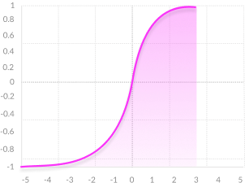
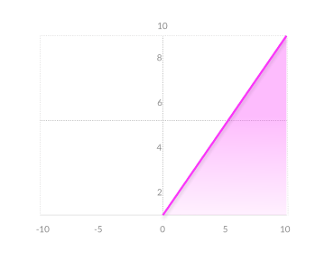
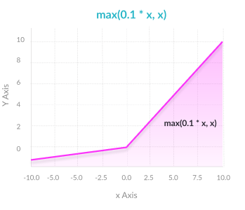
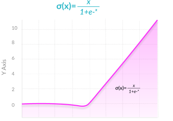

# deep-learning-notes
My notes on most important aspects of deep learning and computer vision

- [Activation Functions](#af)
- [Loss Functions](#lf)
- Optimizers
- Layers
- Regularization
- Optimizers

<div id='af'/>

## Activation Functions

Activations are the most important part of neural networks. Activations functions(AF) determine the output of the deep learning model,it accuracy and computational effieciency of training a model.Activation functions have major effect on neural networks ability to converge and convergence speed.Activtions functions are mathematical equations that determine the ouput of neural network and they also help in normalize the output of each neuron in range between 0 to 1 or between -1 to 1 .The activation function is a simple mathemaical gate between the input feeding the current neuron and its output going to the next layer.Activation function should be computainally effiecient because they are calculated across the thousands or meven millions of neurons for each data sample. In current scenarios we use technique called *back-propagation* to train the model which places additional computational strain on activation function and its derivative functions.

Broadly there are three kinds of activation functions 
1. Binary Step Function
2. Linear Activiavtion Function
3. Non-Linear Activation Function

### 1. Binary Step Function


Binary step function is a thresold based activation fuunction. If the input value is greater than or less than a certain thresold the neuron is activated and sends same signal to next layer.The problem with AF is it does not allow multiple outputs or clasiifying the inputs into several categories.

### 2. Linear Activiavtion Function


The linear activation takes the form **A = cx** . The inputs are multiplied by a constant(**c**) and creates an ouput proportional to the input. It is better than step function and allows multiple outputs rather than **0** and **1**. However it has two major drawbacks.

##### 1. Not possible to use backpropagation
Since the derivative of the function is constant and has no relation to input **x**.

##### 2. All layers of the neural network collapse into one
No matter how many linear activations in neural network, the last layer is a linear function of first layer(because a linear combination of linear functions is still a linear function).A neural network with a linear activation function is simply a linear regression model.

### 3. Non-Linear Activation Function
Modern neural network models use non-linear activation functions. They allow the model to create complex mappings between the network’s inputs and outputs, which are essential for datasets with higher non-linearity.Non-linear functions address the problems of a linear activation function:

1. They allow backpropagation because they have a derivative function which is related to the inputs.

2. They allow “stacking” of multiple layers of neurons to create a deep neural network. Multiple hidden layers of neurons are needed to learn complex data sets with high levels of accuracy.

Most commonly used activation functions are described below:

#### 1. Sigmoid / Logistic


```math
f(x) = \frac{1}{(1+exp^{-x})}
```

##### Advantages

1. Output values bound between **0 and 1**, normalizing the output of each neuron
2. **Clear predictions**—For X above 2 or below -2, tends to bring the Y value (the prediction) to the edge of the curve, very close to 1 or 0. This enables clear predictions.
3. **Smooth gradient**, preventing jumps in output values.

##### Disadvantages

1. **Vanishing gradient**—for very high or very low values of X, there is almost no change to the prediction, causing a vanishing gradient problem. This can result in the network refusing to learn further, or being too slow to reach an accurate prediction.
2. **Outputs not zero centered**.
3. **Computationally expensive**

#### 2. TanH / Hyperbolic Tangent



```math
f(x) = tanh(x) =\frac{sinh(x)}{cosh(x)} =\frac{e^{x}-e^{-x}}{e^{x}+e^{-x}} = \frac{2}{1+e^{-2x}} -1

```
##### Advantages
1. **Zero centered**—making it easier to model inputs that have strongly negative, neutral, and strongly positive values.
2. **Smooth gradient, Output values bound between -1 and 1 , Clear predictions**

##### Disadvantages
1. **Vanishing gradient** , **Computationally expensive**

#### 3. ReLU (Rectified Linear Unit)


```math
f(x) = max(x,0)
```
##### Advantages
1. **Computationally efficient**—allows the network to converge very quickly
2. **Non-linear**—although it looks like a linear function, ReLU has a derivative function and allows for backpropagation

##### Disadvantages
1. **The Dying ReLU problem**—when inputs approach zero, or are negative, the gradient of the function becomes zero, the network cannot perform backpropagation and cannot learn.

#### 4. Leaky ReLU


```math
f(x) = max(x,0.1*x)
```
##### Advantages
1. **Prevents dying ReLU problem**—this variation of ReLU has a small positive slope in the negative area, so it does enable backpropagation, even for negative input values
2. **Computationally efficient, Non-linear**

##### Disadvantages
1. **Results not consistent**—leaky ReLU does not provide consistent predictions for negative input values.

#### 5. Softmax

```math
f(x_i) = \frac{e^{x_i}}{\sum_{j=1}^{n}{e^{x_j}}} 
```
##### Advantages
1. **Able to handle multiple classes** only one class in other activation functions—normalizes the outputs for each class between 0 and 1, and divides by their sum, giving the probability of the input value being in a specific class.
2. **Useful for output neurons**—typically Softmax is used only for the output layer, for neural networks that need to classify inputs into multiple categories.

#### 6. Swish



```math
f(x) = \frac{x}{1+e^{-x}} 
```

Swish is a new, self-gated activation function discovered by researchers at Google.It performs better than ReLU with a similar level of computational efficiency. In experiments on ImageNet with identical models running ReLU and Swish, the new function achieved top-1 classification accuracy 0.6-0.9% higher.

#### 7. Softsign
It is a quadratic polynomial, represented by:
```math
f(x) = \frac{x}{|x|+1} 
```
The main difference between the softsign function and the tanh function is that unlike the tanh function that converges exponentially, the softsign function converges in a polynomial form. 

#### 8. Exponential Linear Units (ELUs)
```math
f(x) =\begin{cases}
    x & \text{if }x\geq 0\,, \\
    \alpha(e^{x}-1) & \text{if }x< 0\,.
  \end{cases}
```


