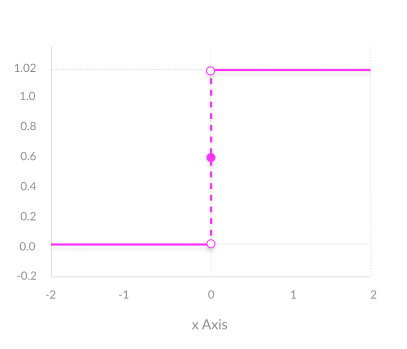

# deep-learning-notes
My notes on most important aspects of deep learning and computer vision

- [Activation Functions](#af)
- [Loss Functions](#lf)
- Optimizers
- Layers
- Regularization
- Optimizers

## Activation Functions

Activations are the most important part of neural networks. Activations functions(AF) determine the output of the deep learning model,it accuracy and computational effieciency of training a model.Activation functions have major effect on neural networks ability to converge and convergence speed.Activtions functions are mathematical equations that determine the ouput of neural network and they also help in normalize the output of each neuron in range between 0 to 1 or between -1 to 1 .The activation function is a simple mathemaical gate between the input feeding the current neuron and its output going to the next layer.Activation function should be computainally effiecient because they are calculated across the thousands or meven millions of neurons for each data sample. In current scenarios we use technique called *back-propagation* to train the model which places additional computational strain on activation function and its derivative functions.

Broadly there are two kinds of activation functions 
1. Binary Step Function
2. Linear Activiavtion Function
3. Non-Linear Activation Function

### 1. Binary Step Function

Binary step function is a thresold based activation fuunction. If the input value is greater than or less than a certain thresold the neuron is activated and sends same signal to next layer.The problem with AF is it does not allow multiple outputs or clasiifying the inputs into several categories.

### 2. Linear Activiavtion Function

The linear activation takes the form **A=cx** . The inputs are multiplied by a constant(**c**) and creates an ouput proportional to the input. It is better than step function and allows multiple outputs rather than **0** and **1**. However it has two major drawbacks.

##### 1. Not possible to use backpropagation
Since the derivative of the function is constant and has no relation to input **x**.

##### 2. All layers of the neural network collapse into one
No matter how many linear activations in neural network, the last layer is a linear function of first layer(because a linear combination of linear functions is still a linear function).A neural network with a linear activation function is simply a linear regression model.

